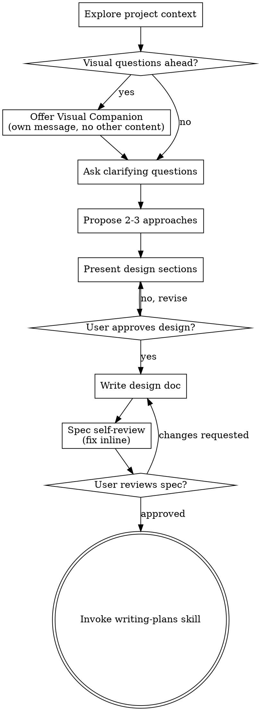

# 把想法脑暴成设计

通过自然、协作式的对话，把想法逐步打磨成完整设计和规格文档。

先理解当前项目上下文，然后一次问一个问题，逐步细化这个想法。等你真正理解要构建什么之后，再展示设计并获得用户批准。

<HARD-GATE>
在你展示设计并获得用户批准之前，不要调用任何实现类 skill，不要写代码，不要搭脚手架，也不要采取任何实现动作。无论项目看起来多简单，这条规则都适用。
</HARD-GATE>

## 反模式：“这太简单了，不需要设计”

每个项目都要经过这套流程。一个 todo list、一个单函数工具、一次配置修改，都一样。越是“简单”的项目，越容易因为未经审视的假设而浪费时间。设计可以很短（如果确实非常简单，几句话就够），但你必须展示设计并获得批准。

## 检查清单

你必须为下面每一项创建任务，并按顺序完成：

1. **探索项目上下文** -> 查看文件、文档、最近提交
2. **提供 visual companion**（如果接下来会涉及视觉问题）-> 这必须是单独一条消息，不能和澄清问题混在一起。见下方 Visual Companion 部分。
3. **提出澄清问题** -> 一次一个，理解目标、约束和成功标准
4. **提出 2-3 种方案** -> 说明权衡，并给出你的推荐
5. **展示设计** -> 按复杂度拆分章节展示，每一节都获得用户批准
6. **写设计文档** -> 保存到 `docs/superpowers/specs/YYYY-MM-DD-<topic>-design.md` 并提交
7. **规格自审** -> 快速检查占位符、矛盾、歧义和范围问题（见下文）
8. **让用户审阅已写出的 spec** -> 在继续前请用户先看 spec 文件
9. **转入实现阶段** -> 调用 `writing-plans` skill 生成实现计划

## 流程图

**流程的终点是调用 `writing-plans`。** 不要调用 `frontend-design`、`mcp-builder` 或任何其他实现类 skill。`brainstorming` 之后唯一应该调用的 skill 就是 `writing-plans`。

## 具体流程

**理解想法：**

- 先查看当前项目状态（文件、文档、最近提交）
- 在提出详细问题前，先评估范围：如果请求描述了多个相互独立的子系统（比如“做一个带聊天、文件存储、计费和分析的平台”），要立刻指出这一点。不要在一个本该先拆分的项目上继续细抠细节。
- 如果项目大到不适合一份 spec 覆盖，就帮助用户拆成子项目：独立部分有哪些、它们如何关联、应该按什么顺序做。然后只对第一个子项目走完整的 brainstorming 流程。每个子项目都要有自己独立的 spec -> plan -> implementation 周期。
- 对于范围合适的项目，一次问一个问题，逐步细化想法
- 尽量优先使用多选题，但开放式问题也可以
- 每条消息只问一个问题。如果一个主题还需要展开，就拆成多轮
- 重点理解：目标、约束、成功标准

**探索方案：**

- 提出 2 到 3 种不同方案，并写清权衡
- 用自然对话方式给出选项，同时带上你的推荐和理由
- 先给出你最推荐的方案，并说明为什么

**展示设计：**

- 当你认为自己已经理解要构建什么时，再展示设计
- 每一节的长度应匹配复杂度：简单情况几句话即可，复杂问题可以写到 200-300 字
- 每展示完一节，都询问用户目前看起来是否正确
- 覆盖内容包括：架构、组件、数据流、错误处理、测试
- 如果有内容说不通，随时回去重新澄清

**为了隔离性与清晰度而设计：**

- 把系统拆成更小的单元，每个单元都只有一个明确职责，通过清晰接口通信，并且能被独立理解和测试
- 对每个单元，你都应该能回答：它做什么、如何使用、依赖什么？
- 一个人能否在不读内部实现的前提下理解这个单元做什么？你能否在不破坏调用方的情况下替换其内部实现？如果不能，边界划分就还不够好。
- 更小、更边界清晰的单元，也更利于你自己工作。你更擅长推理那些可以完整装进上下文的代码；当文件焦点清晰时，你的改动也会更可靠。文件变得过大，通常就是职责过多的信号。

**在现有代码库中工作时：**

- 在提方案之前先探索当前结构，遵循现有模式
- 如果现有代码存在会影响当前工作的结构问题（例如文件太大、边界混乱、职责纠缠），可以把针对性的改良纳入设计，这才是优秀工程师在真实项目里会做的事
- 不要提出与当前目标无关的重构。始终保持聚焦

## 设计之后

**文档：**

- 把已经确认的设计（spec）写入 `docs/superpowers/specs/YYYY-MM-DD-<topic>-design.md`
  - 如果用户对 spec 位置有明确偏好，则以用户偏好为准
- 如果有 `elements-of-style:writing-clearly-and-concisely` skill，可使用它
- 把设计文档提交到 git

**Spec 自审：**
写完 spec 文档后，用新的视角快速看一遍：

1. **占位符扫描：** 有没有 `TBD`、`TODO`、未完成章节或模糊要求？有就修掉。
2. **内部一致性：** 是否有章节互相矛盾？架构是否和功能描述一致？
3. **范围检查：** 这份内容是否足够聚焦，适合做成单一实现计划？还是应该进一步拆分？
4. **歧义检查：** 是否有要求可能被解读成两种不同意思？如果有，选一种并明确写出来。

发现问题就直接在文档里修掉。不需要重新走一轮评审，修完继续即可。

**用户审阅关卡：**
当 spec 自审通过后，请用户先审阅写出的 spec，再继续：

> "Spec written and committed to `<path>`. Please review it and let me know if you want to make any changes before we start writing out the implementation plan."

等待用户回应。如果用户要求修改，就去改，并重新跑一遍 spec 自审。只有在用户批准后才能继续。

**实现：**

- 调用 `writing-plans` skill，写出详细实现计划
- 不要调用其他 skill。下一步只能是 `writing-plans`

## 核心原则

- **一次只问一个问题** -> 不要用多个问题把用户压垮
- **优先多选题** -> 比开放题更容易回答
- **狠抓 YAGNI** -> 从所有设计里移除不必要的功能
- **探索备选方案** -> 在拍板前始终提出 2-3 种方案
- **增量式确认** -> 先展示设计，获批后再前进
- **保持灵活** -> 一旦发现有说不通的地方，就回去重新澄清

## Visual Companion

这是一个基于浏览器的辅助工具，用来在 brainstorming 过程中展示 mockup、图表和视觉方案。它是一个工具，不是一种模式。用户接受 companion，只表示它可以在适合的提问中被使用，不代表接下来每个问题都必须走浏览器。

**如何提供 companion：** 如果你预期接下来的问题会涉及视觉内容（mockup、布局、图表），可以先征求一次同意：
> "Some of what we're working on might be easier to explain if I can show it to you in a web browser. I can put together mockups, diagrams, comparisons, and other visuals as we go. This feature is still new and can be token-intensive. Want to try it? (Requires opening a local URL)"

**这段邀请必须单独发成一条消息。** 不要把它和澄清问题、上下文总结或任何其他内容混在一起。如果用户拒绝，就继续用纯文本 brainstorming。

**每个问题都要重新判断是否需要浏览器：** 判断标准是：**用户通过“看见它”会不会比“读文字”更容易理解？**

- **使用浏览器**：适用于本质上是视觉内容的东西，比如 mockup、wireframe、布局对比、架构图、并排视觉设计对比
- **使用终端**：适用于文本内容，比如需求问题、概念选择、权衡列表、A/B/C/D 文本选项、范围决策

一个问题是 UI 相关，不代表它自动就是视觉问题。比如 “What does personality mean in this context?” 是概念问题，用终端。 “Which wizard layout works better?” 是视觉问题，用浏览器。

如果用户同意使用 companion，在继续之前先阅读详细说明：
`skills/brainstorming/visual-companion.md`
