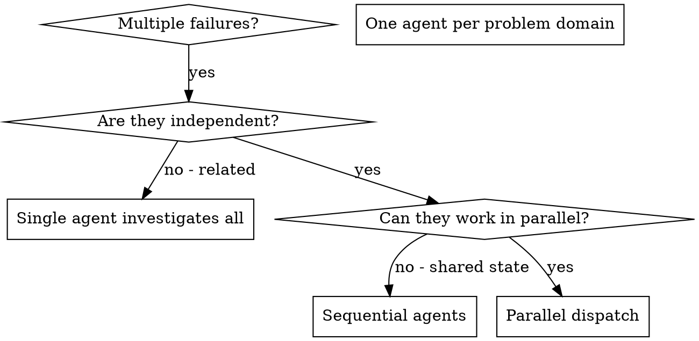

# 派发并行 Agents

## 概览

你要把任务委托给拥有隔离上下文的专门 agent。通过精确设计它们的指令和上下文，你可以确保它们聚焦并完成自己的任务。它们不应该继承你当前会话的上下文或历史，你应该只构造它们真正需要的内容。这样也能保留你自己的上下文，用于协调工作。

当你同时面对多个互不相关的故障（不同测试文件、不同子系统、不同 bug）时，按顺序一个一个排查是在浪费时间。因为每项调查都是独立的，完全可以并行进行。

**核心原则：** 每个独立问题域派一个 agent，让它们并发工作。

## 何时使用



**以下情况适用：**
- 3 个以上测试文件失败，而且根因彼此不同
- 多个子系统独立损坏
- 每个问题都不需要借助其他问题的上下文就能理解
- 各调查之间没有共享状态

**以下情况不要用：**
- 故障彼此相关（修一个可能顺手修掉其他）
- 需要先理解整个系统状态
- agents 之间会互相干扰

## 模式

### 1. 识别独立问题域

按“哪里坏了”来分组：
- 文件 A 测试：工具审批流
- 文件 B 测试：批处理完成行为
- 文件 C 测试：中止功能

每个域都是独立的，例如修工具审批不会影响中止测试。

### 2. 为 Agent 创建聚焦任务

每个 agent 都要拿到：
- **明确范围：** 一个测试文件或一个子系统
- **明确目标：** 让这些测试通过
- **明确约束：** 不要修改其他代码
- **明确输出：** 汇总你发现了什么、修了什么

### 3. 并行派发

```typescript
// In Claude Code / AI environment
Task("Fix agent-tool-abort.test.ts failures")
Task("Fix batch-completion-behavior.test.ts failures")
Task("Fix tool-approval-race-conditions.test.ts failures")
// All three run concurrently
```

### 4. 审阅并集成

当 agents 返回后：
- 阅读每份总结
- 验证修复之间没有冲突
- 运行完整测试集
- 集成所有变更

## Agent Prompt 结构

好的 agent prompt 应该具备：
1. **聚焦** - 只有一个清晰问题域
2. **自包含** - 包含理解问题所需的全部上下文
3. **输出明确** - agent 应该返回什么？

```markdown
Fix the 3 failing tests in src/agents/agent-tool-abort.test.ts:

1. "should abort tool with partial output capture" - expects 'interrupted at' in message
2. "should handle mixed completed and aborted tools" - fast tool aborted instead of completed
3. "should properly track pendingToolCount" - expects 3 results but gets 0

These are timing/race condition issues. Your task:

1. Read the test file and understand what each test verifies
2. Identify root cause - timing issues or actual bugs?
3. Fix by:
   - Replacing arbitrary timeouts with event-based waiting
   - Fixing bugs in abort implementation if found
   - Adjusting test expectations if testing changed behavior

Do NOT just increase timeouts - find the real issue.

Return: Summary of what you found and what you fixed.
```

## 常见错误

**错误：太宽泛** - "Fix all the tests" -> agent 容易迷失  
**正确：够具体** - "Fix agent-tool-abort.test.ts" -> 范围聚焦

**错误：没有上下文** - "Fix the race condition" -> agent 不知道该去哪看  
**正确：补足上下文** - 把错误信息和测试名贴进去

**错误：没有约束** - agent 可能把所有东西都重构  
**正确：加清约束** - 比如 "Do NOT change production code" 或 "Fix tests only"

**错误：输出含糊** - "Fix it" -> 你不知道它改了什么  
**正确：输出明确** - "Return summary of root cause and changes"

## 什么时候不要用

**故障相关联：** 修一个可能顺手修掉别的，先一起调查  
**需要完整上下文：** 必须看全局才能理解  
**探索式调试：** 你还不知道哪里坏了  
**存在共享状态：** agents 会互相干扰（编辑同一文件、使用同一资源）

## 会话中的真实例子

**场景：** 大规模重构后，3 个文件里一共出现 6 个测试失败

**故障：**
- `agent-tool-abort.test.ts`: 3 个失败（时序问题）
- `batch-completion-behavior.test.ts`: 2 个失败（工具没执行）
- `tool-approval-race-conditions.test.ts`: 1 个失败（执行计数 = 0）

**决策：** 三个独立问题域，abort 逻辑、batch completion 和 race conditions 彼此分离

**派发：**
```text
Agent 1 -> Fix agent-tool-abort.test.ts
Agent 2 -> Fix batch-completion-behavior.test.ts
Agent 3 -> Fix tool-approval-race-conditions.test.ts
```

**结果：**
- Agent 1：用基于事件的等待替代超时
- Agent 2：修复事件结构 bug（`threadId` 放错位置）
- Agent 3：增加对异步工具执行完成的等待

**集成：** 所有修复互不冲突，整套测试变绿

**节省时间：** 3 个问题并行解决，而不是顺序排查

## 关键收益

1. **并行化** - 多项调查同时进行
2. **更聚焦** - 每个 agent 范围更窄，追踪上下文更少
3. **互不干扰** - agents 之间不会互相影响
4. **更快** - 用解决 1 个问题的时间解决 3 个问题

## 验证

agents 返回后：
1. **阅读每份总结** - 搞清楚具体改了什么
2. **检查冲突** - agents 是否编辑了同一段代码？
3. **跑完整测试集** - 确认所有修复能一起工作
4. **抽样复核** - agents 也可能系统性犯错

## 真实世界影响

来自一次调试会话（2025-10-03）：
- 3 个文件中有 6 个失败
- 并行派发了 3 个 agents
- 全部调查同时完成
- 所有修复都成功集成
- agent 之间零冲突