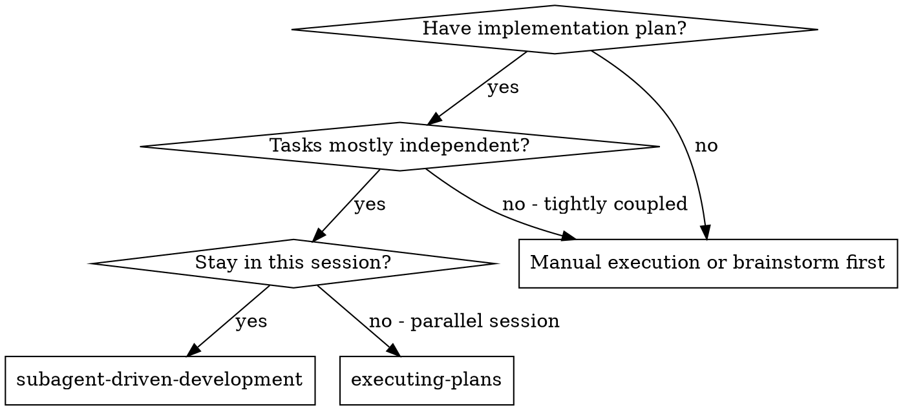
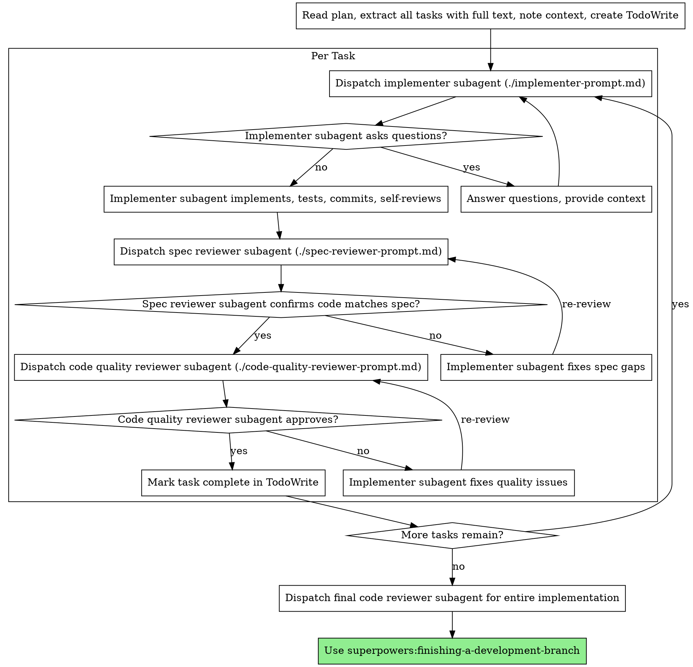

# Subagent 驱动开发

通过“每个任务派发一个全新的 subagent”来执行计划，并在每个任务后进行两阶段评审：先做 spec 一致性检查，再做代码质量检查。

**为什么要用 subagents：** 你把任务委托给拥有隔离上下文的专门 agent。只要你精确构造它们的指令和上下文，就能确保它们保持专注并完成任务。它们不应该继承你当前会话的上下文或历史，而应该只拿到你明确提供给它们的材料。这样也能把你自己的上下文保留下来，用于协调全局工作。

**核心原则：** 每个任务一个全新 subagent + 两阶段评审（先 spec，后质量）= 高质量、快速迭代

## 何时使用



**相对 `executing-plans`（并行会话）的差异：**
- 保持在同一个会话里（不用切上下文）
- 每个任务都派发全新 subagent（避免上下文污染）
- 每个任务后都做两阶段评审：先 spec 一致性，再代码质量
- 迭代更快（任务之间不需要人工插入式停顿）

## 流程



## 模型选择

优先使用“足够胜任”的最弱模型，以节省成本并提高速度。

**机械式实现任务**（独立函数、规格清晰、只改 1-2 个文件）：使用快速且便宜的模型。只要计划写得足够清楚，大多数实现任务本质上都是机械型的。

**集成和判断型任务**（多文件协同、模式匹配、调试）：使用标准模型。

**架构、设计与评审类任务：** 使用当前可用能力中最强的模型。

**任务复杂度信号：**
- 只改 1-2 个文件，且 spec 完整 -> 便宜模型
- 涉及多个文件且有集成风险 -> 标准模型
- 需要设计判断或广泛代码库理解 -> 最强模型

## 处理 Implementer 状态

implementer subagent 会返回四种状态之一。你必须分别处理：

**DONE：** 进入 spec 一致性评审。

**DONE_WITH_CONCERNS：** implementer 完成了工作，但主动标记了顾虑。先读这些顾虑。如果顾虑涉及正确性或范围，就先处理再进入评审；如果只是观察性备注（例如“这个文件开始变大了”），记下来，然后继续评审。

**NEEDS_CONTEXT：** implementer 缺少必要信息。补充上下文后重新派发。

**BLOCKED：** implementer 无法完成任务。此时要评估 blocker：
1. 如果是上下文问题，补更多上下文，然后用同一模型重新派发
2. 如果任务需要更多推理能力，换更强模型重新派发
3. 如果任务太大，拆成更小的部分
4. 如果计划本身就错了，升级给人类处理

**绝不要** 无视升级信号，也不要在不做任何改变的前提下强行让同一模型重试。如果 implementer 说它卡住了，那就说明必须改变某些前提。

## Prompt 模板

- `./implementer-prompt.md` - 派发 implementer subagent
- `./spec-reviewer-prompt.md` - 派发 spec 一致性 reviewer subagent
- `./code-quality-reviewer-prompt.md` - 派发代码质量 reviewer subagent

## 示例工作流

```text
You: I'm using Subagent-Driven Development to execute this plan.

[Read plan file once: docs/superpowers/plans/feature-plan.md]
[Extract all 5 tasks with full text and context]
[Create TodoWrite with all tasks]

Task 1: Hook installation script

[Get Task 1 text and context (already extracted)]
[Dispatch implementation subagent with full task text + context]

Implementer: "Before I begin - should the hook be installed at user or system level?"

You: "User level (~/.config/superpowers/hooks/)"

Implementer: "Got it. Implementing now..."
[Later] Implementer:
  - Implemented install-hook command
  - Added tests, 5/5 passing
  - Self-review: Found I missed --force flag, added it
  - Committed

[Dispatch spec compliance reviewer]
Spec reviewer: Spec compliant - all requirements met, nothing extra

[Get git SHAs, dispatch code quality reviewer]
Code reviewer: Strengths: Good test coverage, clean. Issues: None. Approved.

[Mark Task 1 complete]

Task 2: Recovery modes

[Get Task 2 text and context (already extracted)]
[Dispatch implementation subagent with full task text + context]

Implementer: [No questions, proceeds]
Implementer:
  - Added verify/repair modes
  - 8/8 tests passing
  - Self-review: All good
  - Committed

[Dispatch spec compliance reviewer]
Spec reviewer: Issues:
  - Missing: Progress reporting (spec says "report every 100 items")
  - Extra: Added --json flag (not requested)

[Implementer fixes issues]
Implementer: Removed --json flag, added progress reporting

[Spec reviewer reviews again]
Spec reviewer: Spec compliant now

[Dispatch code quality reviewer]
Code reviewer: Strengths: Solid. Issues (Important): Magic number (100)

[Implementer fixes]
Implementer: Extracted PROGRESS_INTERVAL constant

[Code reviewer reviews again]
Code reviewer: Approved

[Mark Task 2 complete]

...

[After all tasks]
[Dispatch final code-reviewer]
Final reviewer: All requirements met, ready to merge

Done!
```

## 优势

**相对手动执行：**
- subagents 会天然地更好遵守 TDD
- 每个任务都是全新上下文（更少混乱）
- 并行安全（subagents 彼此不干扰）
- subagent 可以在工作前后都提问

**相对 `executing-plans`：**
- 同一会话内完成（无 handoff）
- 进度持续推进（不用频繁等停顿）
- 评审检查点自动化

**效率收益：**
- controller 直接提供完整任务文本，减少 file reading 开销
- controller 只提供真正需要的上下文
- subagent 一上来就能拿到完整信息
- 问题会在工作开始前暴露，而不是做完才发现

**质量闸门：**
- self-review 会在交接前先挡掉一批问题
- 两阶段评审：先 spec 一致性，再代码质量
- 评审循环保证修复真正生效
- spec 一致性评审防止做多或做少
- 代码质量评审确保实现本身扎实

**成本：**
- subagent 调用更多（每个任务：implementer + 2 个 reviewers）
- controller 预处理更多（要先提取全部任务）
- 评审循环会增加迭代次数
- 但它能更早抓问题（比事后调试便宜）

## 红旗信号

**绝不要：**
- 未经用户明确同意就在 `main/master` 分支上开始实现
- 跳过评审（不管是 spec 一致性还是代码质量）
- 带着未修复问题继续往下走
- 并行派发多个 implementer subagents（很容易冲突）
- 让 subagent 自己去读 plan 文件（你应该直接提供全文）
- 跳过 scene-setting 上下文（subagent 必须知道任务放在什么位置）
- 无视 subagent 的问题（必须先回答再让它继续）
- 对 spec 一致性用“差不多就行”（reviewer 说有问题 = 还没完成）
- 跳过 review loops（reviewer 提了问题 = implementer 修 = reviewer 再看）
- 用 implementer 的 self-review 替代真正评审（两者都要）
- **在 spec 一致性没通过前就开始代码质量评审**（顺序错了）
- 当任何一轮评审仍有 open issues 时就进入下一个任务

**如果 subagent 提问：**
- 回答要清晰且完整
- 必要时补更多上下文
- 不要催它在没搞懂前就开工

**如果 reviewer 提出问题：**
- 由同一个 implementer subagent 负责修
- reviewer 必须再次评审
- 直到通过为止
- 不要跳过复审

**如果 subagent 没完成任务：**
- 派发专门的 fix subagent，并给出明确指令
- 不要自己手动补（避免上下文污染）

## 集成关系

**必需的工作流 skills：**
- **`superpowers:using-git-worktrees`** - 必需：开始前先准备隔离工作区
- **`superpowers:writing-plans`** - 用来生成本 skill 要执行的计划
- **`superpowers:requesting-code-review`** - reviewer subagent 的评审模板来源
- **`superpowers:finishing-a-development-branch`** - 所有任务完成后的收尾

**Subagents 本身应使用：**
- **`superpowers:test-driven-development`** - implementer 在每个任务中遵守 TDD

**替代工作流：**
- **`superpowers:executing-plans`** - 如果不是在同一会话里推进，而是并行会话，则使用它