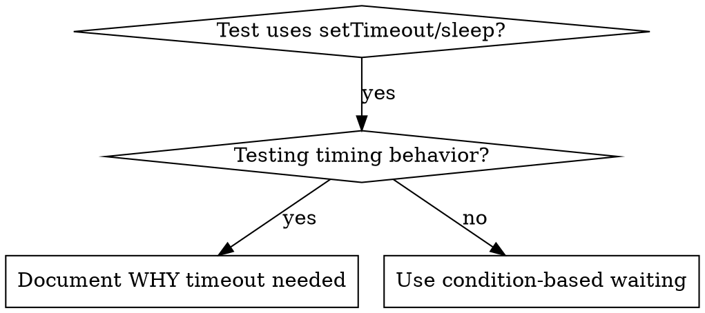

# 基于条件的等待

## 概览

不稳定的测试经常依赖随意编写的延迟来猜测时序。这会导致竞态条件：在快速机器上能通过，但在高负载或 CI 环境中却会失败。

**核心原则：** 等待你真正关心的条件出现，而不是猜测它大概需要多长时间。

## 何时使用



**以下情况应使用：**
- 测试中存在任意延迟（`setTimeout`、`sleep`、`time.sleep()`）
- 测试不稳定（有时通过，有时在高负载下失败）
- 测试并行运行时超时
- 需要等待异步操作完成

**以下情况不应直接替换：**
- 你就是在测试真实的时间行为（例如 debounce、throttle 间隔）
- 如果确实需要使用任意 timeout，必须写清楚 **为什么**

## 核心模式

```typescript
// 错误：靠猜时间
await new Promise(r => setTimeout(r, 50));
const result = getResult();
expect(result).toBeDefined();

// 正确：等待条件成立
await waitFor(() => getResult() !== undefined);
const result = getResult();
expect(result).toBeDefined();
```

## 快速模式表

| 场景 | 模式 |
|----------|---------|
| 等待事件 | `waitFor(() => events.find(e => e.type === 'DONE'))` |
| 等待状态 | `waitFor(() => machine.state === 'ready')` |
| 等待数量 | `waitFor(() => items.length >= 5)` |
| 等待文件 | `waitFor(() => fs.existsSync(path))` |
| 复杂条件 | `waitFor(() => obj.ready && obj.value > 10)` |

## 实现

通用轮询函数：
```typescript
async function waitFor<T>(
  condition: () => T | undefined | null | false,
  description: string,
  timeoutMs = 5000
): Promise<T> {
  const startTime = Date.now();

  while (true) {
    const result = condition();
    if (result) return result;

    if (Date.now() - startTime > timeoutMs) {
      throw new Error(`Timeout waiting for ${description} after ${timeoutMs}ms`);
    }

    await new Promise(r => setTimeout(r, 10)); // 每 10ms 轮询一次
  }
}
```

完整实现及领域辅助函数（`waitForEvent`、`waitForEventCount`、`waitForEventMatch`）见本目录下的 `condition-based-waiting-example.ts`，它来自一次真实的调试会话。

## 常见错误

**错误：轮询过快** - `setTimeout(check, 1)`，浪费 CPU  
**修复：** 每 10ms 轮询一次

**错误：没有超时** - 条件永远不成立时会无限循环  
**修复：** 始终包含超时，并给出清晰的错误信息

**错误：读取了陈旧数据** - 在循环外缓存状态  
**修复：** 在循环内部调用 getter，确保每次读取最新值

## 什么时候任意 Timeout 才是正确的

```typescript
// 工具每 100ms 触发一次 - 需要 2 次触发来验证部分输出
await waitForEvent(manager, 'TOOL_STARTED'); // 首先：等待条件
await new Promise(r => setTimeout(r, 200));   // 然后：等待基于时间的行为
// 200ms = 以 100ms 间隔触发 2 次 - 有文档记录且理由充分
```

**要求：**
1. 先等待触发条件出现
2. 这个等待必须基于已知时序，而不是瞎猜
3. 用注释明确说明 **为什么**

## 真实世界影响

来自一次调试会话（2025-10-03）：
- 修复了 3 个文件中的 15 个不稳定测试
- 通过率：60% -> 100%
- 执行时间：快了 40%
- 竞态条件不再复现