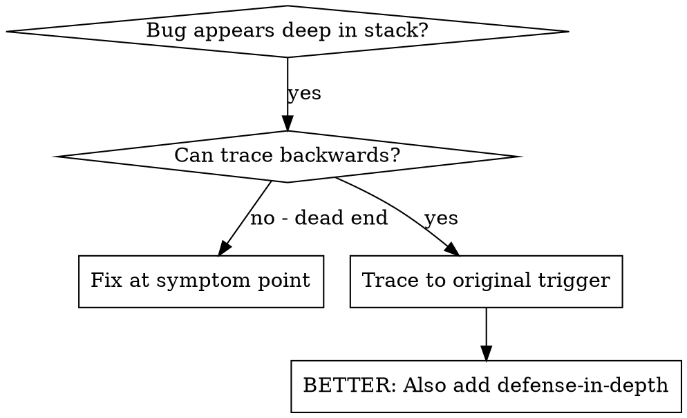
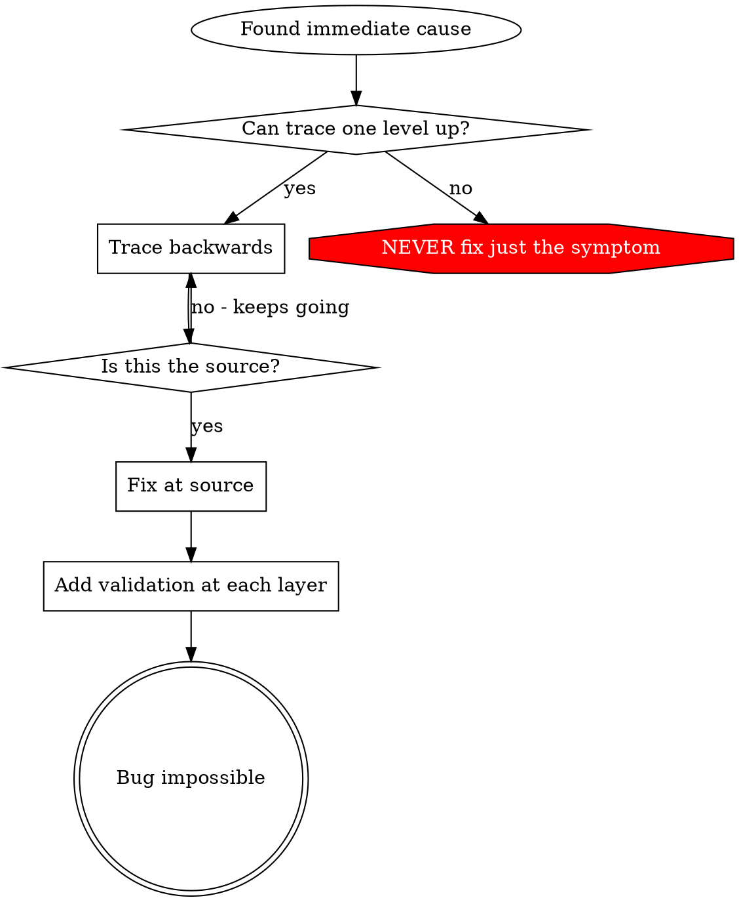

# 根因追踪

## 概览

Bug 往往在调用栈很深的地方才暴露出来（例如 `git init` 在错误目录运行、文件创建到了错误位置、数据库用错路径打开）。你的直觉可能是直接在报错处修复，但那只是在处理症状。

**核心原则：** 沿调用链向后追踪，直到找到最初触发它的源头，然后在源头修复。

## 何时使用



**以下情况应使用：**
- 错误出现在执行流程很深的地方，而不是入口处
- Stack trace 很长
- 不清楚无效数据最早是从哪里来的
- 需要找出到底是哪段测试/代码触发了问题

## 追踪流程

### 1. 先观察症状
```text
Error: git init failed in /Users/jesse/project/packages/core
```

### 2. 找到直接原因
**是哪段代码直接导致了这个错误？**
```typescript
await execFileAsync('git', ['init'], { cwd: projectDir });
```

### 3. 继续追问：是谁调用了它？
```typescript
WorktreeManager.createSessionWorktree(projectDir, sessionId)
  -> called by Session.initializeWorkspace()
  -> called by Session.create()
  -> called by test at Project.create()
```

### 4. 一直向上追踪
**被传入的值是什么？**
- `projectDir = ''`（空字符串！）
- 空字符串作为 `cwd` 时会退回到 `process.cwd()`
- 那正好就是源码目录！

### 5. 找到最初触发点
**空字符串最早从哪里来的？**
```typescript
const context = setupCoreTest(); // Returns { tempDir: '' }
Project.create('name', context.tempDir); // Accessed before beforeEach!
```

## 添加调用栈日志

如果你无法靠手工追踪清楚，就添加埋点：

```typescript
// Before the problematic operation
async function gitInit(directory: string) {
  const stack = new Error().stack;
  console.error('DEBUG git init:', {
    directory,
    cwd: process.cwd(),
    nodeEnv: process.env.NODE_ENV,
    stack,
  });

  await execFileAsync('git', ['init'], { cwd: directory });
}
```

**关键点：** 在测试里用 `console.error()`，不要用 logger，因为 logger 可能不会显示出来。

**运行并抓取：**
```bash
npm test 2>&1 | grep 'DEBUG git init'
```

**分析 stack traces：**
- 看看有哪些测试文件名
- 找到触发调用的行号
- 识别共同模式（是不是同一个测试？同一个参数？）

## 找出是哪条测试污染了环境

如果某个副作用是在测试期间出现，但你不知道是哪条测试引起的：

可以使用本目录里的二分脚本 `find-polluter.sh`：

```bash
./find-polluter.sh '.git' 'src/**/*.test.ts'
```

它会逐条运行测试，并在发现第一个污染源时停止。具体用法见脚本本身。

## 真实示例：空的 `projectDir`

**症状：** `.git` 被创建在 `packages/core/`（源码目录）

**追踪链：**
1. `git init` 在 `process.cwd()` 中运行 -> 说明 `cwd` 参数为空
2. `WorktreeManager` 被传入空的 `projectDir`
3. `Session.create()` 又把空字符串继续向下传递
4. 测试在 `beforeEach` 执行前就访问了 `context.tempDir`
5. `setupCoreTest()` 初始返回的是 `{ tempDir: '' }`

**根因：** 顶层变量初始化时读取了一个还没准备好的空值

**修复：** 把 `tempDir` 改成 getter，并在它在 `beforeEach` 前被访问时直接抛出错误

**同时补上了纵深防御：**
- 第 1 层：`Project.create()` 校验目录
- 第 2 层：`WorkspaceManager` 校验非空
- 第 3 层：`NODE_ENV` 防护，拒绝在 tmpdir 之外执行 `git init`
- 第 4 层：在 `git init` 前打印 stack trace

## 关键原则



**绝不要只修报错出现的地方。** 一定要向后追到最初触发点。

## Stack Trace 小技巧

**在测试中：** 用 `console.error()`，不要用 logger，因为 logger 可能被压掉  
**在操作之前：** 在危险操作执行前打日志，而不是失败后才打  
**带上上下文：** 记录目录、`cwd`、环境变量、时间戳  
**抓取完整调用栈：** `new Error().stack` 能展示完整调用链

## 真实世界影响

来自一次调试会话（2025-10-03）：
- 通过 5 层追踪找到了真正根因
- 在源头修复了问题（getter 校验）
- 额外补了 4 层防御
- 1847 个测试全部通过，且零污染