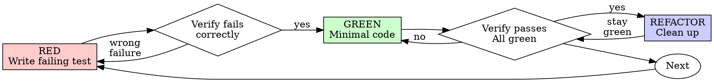

# 测试驱动开发（TDD）

## 概览

先写测试。看它失败。再写最小实现让它通过。

**核心原则：** 如果你没有亲眼看着测试先失败，你就不知道它测试的到底是不是正确的东西。

**违背这些规则的字面要求，也是在违背它们的精神。**

## 何时使用

**始终使用：**
- 新功能
- bug 修复
- 重构
- 行为变更

**例外情况（先问你的人类搭档）：**
- 一次性原型
- 生成代码
- 配置文件

如果你脑中冒出“这次就先跳过 TDD 吧”，停下。那是在给自己找借口。

## 铁律

```text
NO PRODUCTION CODE WITHOUT A FAILING TEST FIRST
```

先写了代码，后写测试？删掉，重新来。

**没有例外：**
- 不要把那段代码留着“当参考”
- 不要在写测试时“顺便改着适配”
- 不要继续看它
- 说删掉，就是真的删掉

从测试重新出发，重新实现。没有商量。

## Red-Green-Refactor



### RED - 写失败测试

写一个最小测试，明确表达“应该发生什么”。

<Good>
```typescript
test('retries failed operations 3 times', async () => {
  let attempts = 0;
  const operation = () => {
    attempts++;
    if (attempts < 3) throw new Error('fail');
    return 'success';
  };

  const result = await retryOperation(operation);

  expect(result).toBe('success');
  expect(attempts).toBe(3);
});
```
名字清晰，测试真实行为，只测试一件事
</Good>

<Bad>
```typescript
test('retry works', async () => {
  const mock = jest.fn()
    .mockRejectedValueOnce(new Error())
    .mockRejectedValueOnce(new Error())
    .mockResolvedValueOnce('success');
  await retryOperation(mock);
  expect(mock).toHaveBeenCalledTimes(3);
});
```
名字模糊，测的是 mock，不是代码
</Bad>

**要求：**
- 一次只测一个行为
- 名字清晰
- 尽量走真实代码（除非实在无法避免，否则不要 mock）

### Verify RED - 看着它先失败

**强制要求，绝不能跳过。**

```bash
npm test path/to/test.test.ts
```

确认：
- 测试是失败的（而不是直接报错）
- 失败信息符合预期
- 它是因为功能缺失而失败，而不是因为 typo

**测试直接通过了？** 说明你测的是已有行为。去修测试。

**测试报错了？** 修掉测试本身的错误，重新跑，直到它“以正确方式失败”为止。

### GREEN - 写最小实现

写出能让测试通过的最简单代码。

<Good>
```typescript
async function retryOperation<T>(fn: () => Promise<T>): Promise<T> {
  for (let i = 0; i < 3; i++) {
    try {
      return await fn();
    } catch (e) {
      if (i === 2) throw e;
    }
  }
  throw new Error('unreachable');
}
```
刚好够通过
</Good>

<Bad>
```typescript
async function retryOperation<T>(
  fn: () => Promise<T>,
  options?: {
    maxRetries?: number;
    backoff?: 'linear' | 'exponential';
    onRetry?: (attempt: number) => void;
  }
): Promise<T> {
  // YAGNI
}
```
过度设计
</Bad>

不要额外加功能，不要顺手重构其他代码，也不要“顺便优化”到超出测试要求。

### Verify GREEN - 看着它通过

**强制要求。**

```bash
npm test path/to/test.test.ts
```

确认：
- 该测试已通过
- 其他测试也仍然通过
- 输出干净（没有 errors、warnings）

**测试失败？** 修代码，不修测试。

**其他测试失败？** 现在就修。

### REFACTOR - 清理

只在绿了之后做：
- 去重
- 改善命名
- 提取辅助函数

保持测试持续为绿。不要引入新行为。

### Repeat

下一个功能，继续从下一个失败测试开始。

## 好测试的标准

| Quality | Good | Bad |
|---------|------|-----|
| **Minimal** | 只测一件事。名字里出现 “and”？拆开。 | `test('validates email and domain and whitespace')` |
| **Clear** | 名字能描述行为 | `test('test1')` |
| **Shows intent** | 展示目标 API 应该如何工作 | 把代码意图遮住了 |

## 为什么顺序如此重要

**“我先把代码写出来，之后补测试确认就行”**

代码写完后再补的测试，往往第一次跑就通过。但“第一次就通过”什么也证明不了：
- 它可能测错了东西
- 它可能测的是实现细节，而不是行为
- 它可能漏掉了你忘记考虑的边界情况
- 你从来没看过它抓到 bug

test-first 强迫你先看到测试失败，证明这个测试真的有测试价值。

**“我已经手动把所有边界情况都测过了”**

手动测试是临时性的，你以为自己测全了，但其实：
- 没有记录，事后无法确认到底测了什么
- 代码一变，没法稳定重跑
- 压力一大就容易漏
- “我试的时候没问题” != 系统覆盖完整

自动化测试才是系统化的。它每次都以同样方式运行。

**“删掉已经写了 X 小时的代码太浪费了”**

这是沉没成本谬误。时间已经花掉了，现在你的选择只有两种：
- 删掉，用 TDD 重写（再花 X 小时，但信心高）
- 留着，事后补测试（省 30 分钟，但信心低，而且大概率埋坑）

真正的浪费，是保留一段你无法信任的代码。没有真实测试支撑的“能跑代码”，本质上就是技术债。

**“TDD 太教条了，真正务实的人应该灵活一点”**

TDD 本身就是务实：
- 在提交前就能发现 bug（比上线后再 debug 快）
- 防止回归（测试会立刻提醒哪里坏了）
- 文档化行为（测试天然展示怎么使用）
- 让重构更安全（想怎么改都行，测试会兜底）

所谓“务实”的捷径，通常只是把调试挪到生产环境去做，反而更慢。

**“事后补测试其实也能达到一样的目标，这重要的是精神不是形式”**

不是。事后写测试回答的是“这段代码现在做了什么？”  
测试先行回答的是“它本来就应该做什么？”

事后测试会被你的现有实现带偏。你测的是你已经写出来的东西，而不是需求本身。你验证的是自己记住了哪些边界情况，而不是在实现前就发现了哪些边界情况。

30 分钟事后补测试 != TDD。你也许得到了覆盖率，但失去了“测试真的能抓错”的证明。

## 常见自我合理化

| Excuse | Reality |
|--------|---------|
| “太简单了，不值得测” | 简单代码也会坏。测试只要 30 秒。 |
| “我之后再测” | 一上来就通过的测试什么也证明不了。 |
| “事后补测试效果一样” | Tests-after = “现在做了什么？”；Tests-first = “本该做什么？” |
| “我已经手动测过了” | 临时性 != 系统化。没有记录，也无法重跑。 |
| “删掉 X 小时的代码太浪费” | 沉没成本谬误。保留未验证代码才是真浪费。 |
| “先留着当参考，再写测试” | 你一定会边看边改。那就是事后测试。删掉就是真的删。 |
| “我得先探索一下” | 可以。探索完扔掉，再从 TDD 正式开始。 |
| “这太难测，说明没必要测” | 难测通常说明设计不清晰。 |
| “TDD 会拖慢我” | TDD 比事后 debug 更快。真正务实就是 test-first。 |
| “手动测更快” | 手动无法证明边界情况。每次修改你都得重测一遍。 |
| “这段旧代码本来就没测试” | 现在轮到你改它，你就该把测试补起来。 |

## 红旗信号：停下并重来

- 先写代码，后写测试
- 实现完之后才补测试
- 测试第一次就直接通过
- 你说不清测试为什么失败
- 测试被安排到“后面再补”
- 你开始说“就这一次”
- “我已经手动测过了”
- “事后补测试也一样”
- “重点是精神，不是形式”
- “先留着当参考” 或 “我照着改一下”
- “已经花了 X 小时，删掉太浪费”
- “TDD 太教条了，我是在务实”
- “这次不一样，因为……”

**只要出现以上任一条：删掉代码，按 TDD 重新开始。**

## 示例：修 bug

**Bug：** 空邮箱会被接受

**RED**
```typescript
test('rejects empty email', async () => {
  const result = await submitForm({ email: '' });
  expect(result.error).toBe('Email required');
});
```

**Verify RED**
```bash
$ npm test
FAIL: expected 'Email required', got undefined
```

**GREEN**
```typescript
function submitForm(data: FormData) {
  if (!data.email?.trim()) {
    return { error: 'Email required' };
  }
  // ...
}
```

**Verify GREEN**
```bash
$ npm test
PASS
```

**REFACTOR**
如果多个字段都要类似校验，再提取验证逻辑。

## 验证清单

在你声称工作完成前，确认：

- [ ] 每个新增函数/方法都有测试
- [ ] 你亲眼看过每个测试在实现前先失败
- [ ] 每个测试都是因预期原因失败（功能缺失，而不是 typo）
- [ ] 你只写了让测试通过所需的最小代码
- [ ] 所有测试都通过
- [ ] 输出干净（没有 errors、warnings）
- [ ] 测试尽量走真实代码（mock 仅在无法避免时使用）
- [ ] 边界情况和错误路径都已覆盖

有任何一项勾不上？那你就跳过了 TDD。回去重来。

## 卡住时怎么办

| Problem | Solution |
|---------|----------|
| 不知道怎么测 | 先写你期望中的 API，再写断言。必要时问你的人类搭档。 |
| 测试太复杂 | 说明设计太复杂。先简化接口。 |
| 什么都得 mock | 说明代码耦合太重。用依赖注入。 |
| 测试准备太庞大 | 提取 helper。如果还是复杂，就说明设计该简化。 |

## 与调试的集成

发现 bug？先写能复现它的失败测试。然后按 TDD 循环修。

测试既能证明修复有效，也能防止回归。

永远不要在没有测试的情况下修 bug。

## 测试反模式

当你要增加 mocks 或测试工具时，先读 `@testing-anti-patterns.md`，避免常见坑：
- 测的是 mock 行为，不是真实行为
- 往生产类里加只给测试用的方法
- 在没搞清依赖关系时就乱 mock

## 最终规则

```text
Production code -> test exists and failed first
Otherwise -> not TDD
```

没有你的人类搭档许可，不存在例外。
